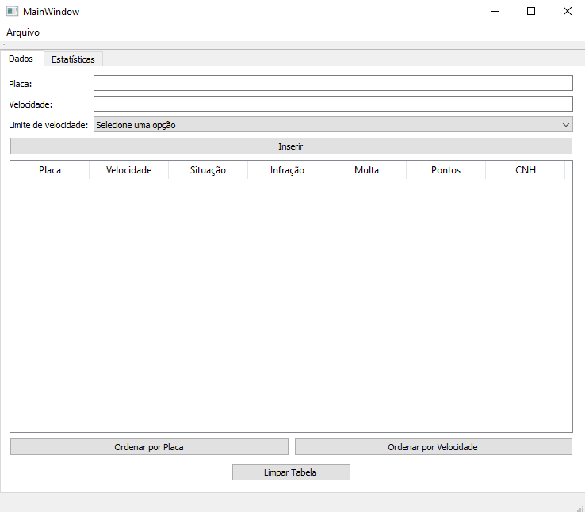

# E-Multas
### Projeto desenvolvido para a disciplina de Técnicas de Programação. E-Multas é um software direcionado para usuários que gerenciam as ocorrências de multas de trânsito por excesso de velocidade através de radar eletrônico.

O E-Multas permite que o usuário forneça a placa, a velocidade instântanea do veículo no momento de detecção pelo radar e o limite de velocidade máxima permitido na rodovia.

Além da aba "Dados", o aplicativo conta também com uma tela de estatísticas chamada "E-multas Statistics", onde são mostradas a quantidade de veículos multados e o valor da soma de todas as multas.

