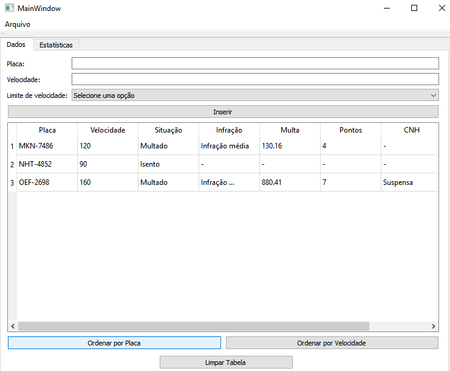
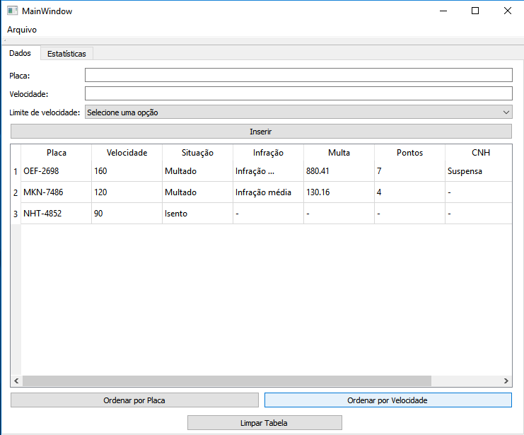
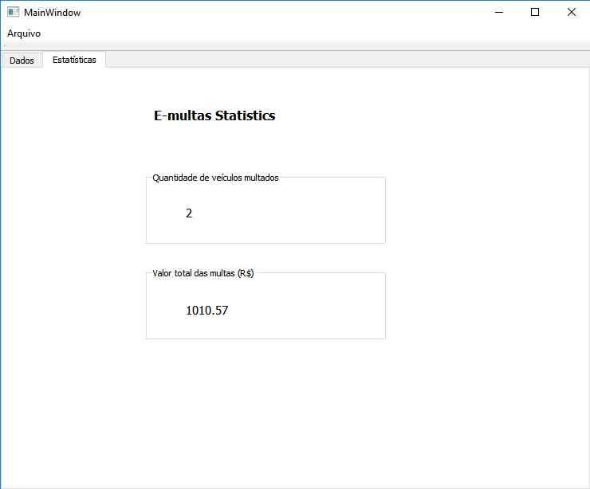
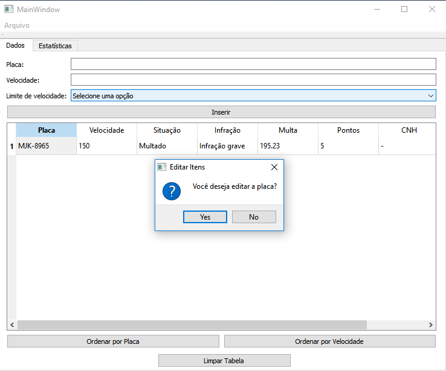
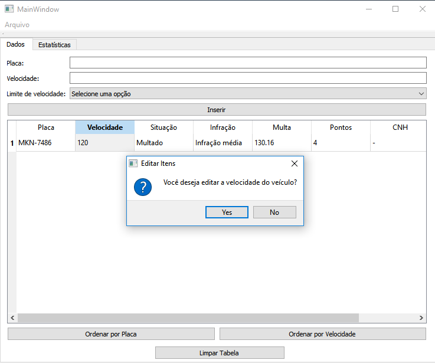
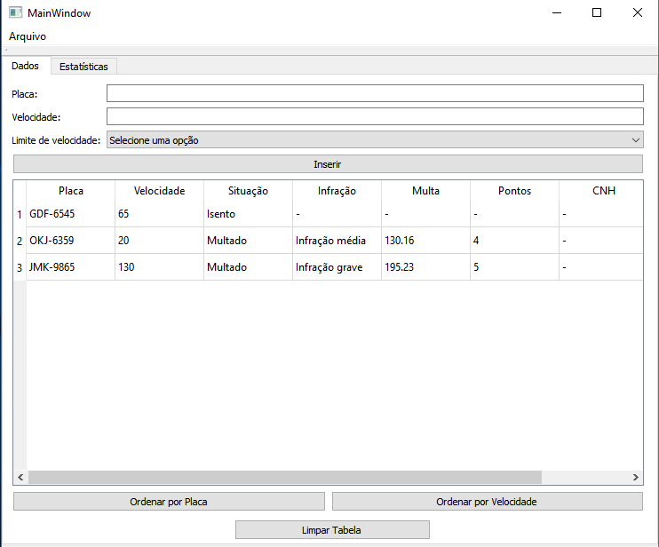
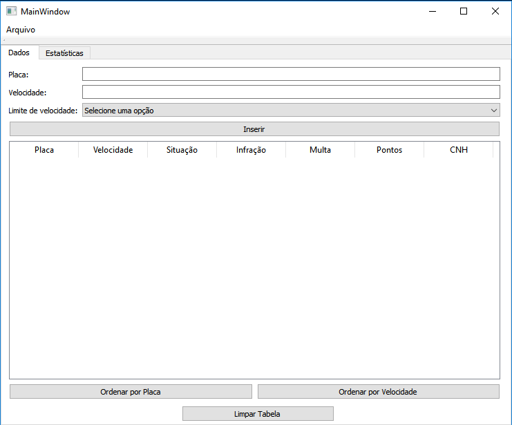

# E-Multas
### Projeto desenvolvido para a disciplina de Técnicas de Programação 2019.1. O E-Multas é um software direcionado para usuários que gerenciam as ocorrências de multas de trânsito por excesso de velocidade através de radar eletrônico.

O E-Multas permite que o usuário forneça a placa, a velocidade instântanea do veículo no momento de detecção pelo radar e o limite de velocidade máxima permitido.

Além da aba "Dados", o aplicativo conta também com uma tela de estatísticas chamada "E-multas Statistics", onde são mostradas a quantidade de veículos multados e o valor da soma de todas as multas.

# Manual do Usuário

O E-multas foi desenvolvido para atender às necessidades dos usuários que trabalham no departamento de multas de trânsito por excesso de velocidade, pensando nisso o aplicativo apresenta uma interface bastante simples e gerando dados automaticamente, baseados na Nova Lei de Trânsito 2019 (Lei 13.804/2019).

### Como utilizar?

Basta digitar a placa correspondente ao veículo, sua respectiva velocidade instantânea em km/h e definir um limite de velocidade predeterminado. 

Feito isso, agora é só clicar no botão "Inserir" para que todos os dados relativos ao veículos sejam exibidos.

No exemplo acima, como o limite de velocidade definido foi de 100 km/h, a velocidade do veículo cadastrado ultrapassou o limite, portanto o aplicativo exibe os dados correspondentes a quanto a velocidade excedeu o limite permitido. Desse modo temos, a situação, o grau da infração, o valor da multa, a quantidade de perda de pontos na CNH e se a mesma foi suspensa ou não.

### Como ordenar os veículos por placa e por velocidade?

O aplicativo contém dois botões na parte debaixo de sua interface. Basta apenas clicar em uma das opções, "Ordenar por Placa" ou "Ordenar por Velocidade", que imediatamente o programa será exibir os veículos em ordem decrescente baseado no critério selecionado. A primeira imagem mostrará a ordenação dos veículos por ordem alfabética da placa e a segunda imagem mostrará os veículos ordenados pela velocidade.

## Como vejo as estatísticas?

Basta clicar na aba "Estatísticas" no canto superior esquerdo, ao lado da aba "Dados". O E-multas Statistics exibirá quantos veículos foram multados pelo radar e a soma total das multas.

## Como posso editar a placa ou a velocidade do veículo após ter inserido na tabela?

Se você errou algum dado algo inserir na tabela, não se preocupe, o aplicativo permite que você dê duplo clique no alvo a ser editado (placa ou velocidade).

#### Placa

Após clicar duas vezes na célula da placa, aparecerá uma caixa de mensagem perguntando se você deseja alterar a placa.

Se você clicar em "Yes", uma caixa de entrada de dados aparecerá e você poderá colocar o nome alterado.

#### Velocidade

Após clicar duas vezes na célula da velocidade, aparecerá uma caixa de mensagem perguntando se você deseja alterar a placa.

Se você clicar em "Yes", uma caixa de entrada de dados aparecerá e você poderá colocar o nome alterado.

## Como excluo os dados da tabela?

Muito simples, basta clicar em "Limpar Tabela" que automaticamente as linhas serão apagadas.

## Como posso salvar os veículos em um arquivo? ou a velocidade do veículo após ter inserido na tabela?

